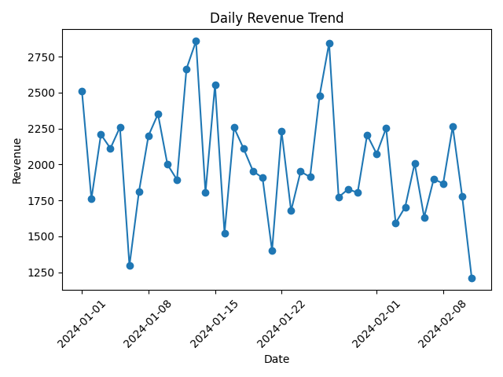
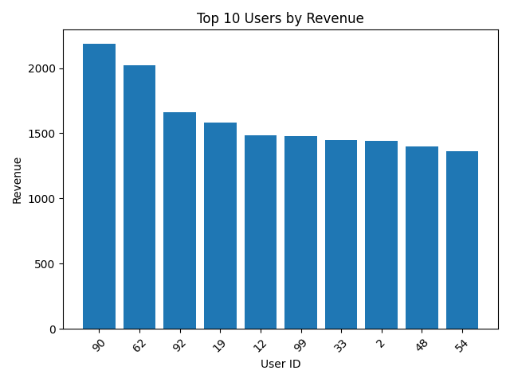
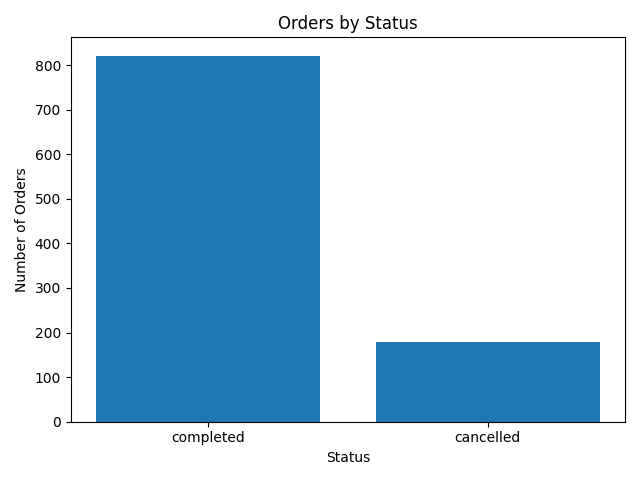
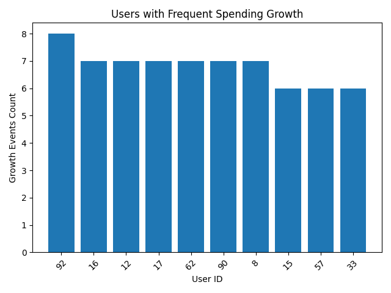

# Ecommerce Analytics Project (SQL + Pandas)

## 📌 Project Overview

This project analyzes ecommerce transaction data to understand:

- revenue trends over time  
- distribution of user spending  
- operational efficiency (order completion)  
- behavioral changes in customer spending  

The goal is to move beyond simple aggregates and identify **actionable patterns in user behavior**.

---

## 🎯 Key Focus

- Translate SQL analytics patterns into pandas  
- Work with transaction-level data  
- Detect behavioral changes using window functions (LAG)  
- Build reusable analysis patterns  

---

## 🧰 Tech Stack

- Python (pandas)  
- SQL (analytical patterns)  
- Matplotlib (visualization)  
- Google Colab  

---

## 📊 Dataset

- Synthetic transaction dataset (based on `seaborn tips`)  
- Transformed into ecommerce-style data  

Columns:
- `user_id`  
- `order_date`  
- `amount`  
- `status` (completed / cancelled)  

---

# 📈 Analysis

---

## D1 — Revenue Overview

Daily revenue is calculated using completed orders only.

```sql
SELECT
    DATE(order_date) AS date,
    SUM(amount) AS daily_revenue
FROM orders
WHERE status = 'completed'
GROUP BY DATE(order_date)
ORDER BY date;
```



### Insights

- Revenue remains relatively stable over time  
- No strong upward or downward trend observed  
- Daily fluctuations are moderate and consistent  
- Revenue reflects only completed transactions (clean KPI)  

---

## D2 — User Revenue Analysis

Total revenue per user is calculated to identify high-value customers.

```sql
SELECT
    user_id,
    SUM(amount) AS total_revenue
FROM orders
WHERE status = 'completed'
GROUP BY user_id
ORDER BY total_revenue DESC
LIMIT 10;
```



### Insights

- A small group of users generates a large share of total revenue  
- High-value users significantly outperform average users  
- Revenue distribution is uneven (typical for ecommerce)  
- Segmentation enables targeted retention and upselling strategies  

---

## D3 — Order Status Analysis

Order completion efficiency is evaluated.

```sql
SELECT
    status,
    COUNT(*) AS order_count
FROM orders
GROUP BY status;
```



### Insights

- Most orders are successfully completed  
- Cancellation rate is relatively low  
- High completion rate indicates efficient operations  
- Monitoring cancellations helps detect friction in the purchase process  

---

## D4 — User Spending Growth (Behavioral Analysis)

Each transaction is compared to the previous one using a window function.

```sql
LAG(amount) OVER (PARTITION BY user_id ORDER BY order_date)
```

Growth is calculated and significant increases (≥20%) are identified.

```sql
WITH transactions AS (
    SELECT
        user_id,
        order_date,
        amount,
        LAG(amount) OVER (
            PARTITION BY user_id
            ORDER BY order_date
        ) AS prev_amount
    FROM orders
),
growth AS (
    SELECT
        *,
        (amount - prev_amount) / prev_amount AS growth_pct
    FROM transactions
)
SELECT
    user_id,
    COUNT(*) AS growth_events_count,
    AVG(growth_pct) AS avg_growth
FROM growth
WHERE growth_pct >= 0.2
GROUP BY user_id
ORDER BY growth_events_count DESC;
```



### Insights

- Some users consistently increase their spending over time  
- These users represent high-potential customers  
- Growth patterns may indicate successful upselling or increasing trust  
- This approach captures behavioral change, not just total spend  

---

# 🔄 SQL ↔ Pandas Pattern Mapping

| Task | SQL | Pandas |
|-----|-----|--------|
| Aggregation | GROUP BY | `.groupby().agg()` |
| Filtering | WHERE | boolean indexing |
| Sorting | ORDER BY | `.sort_values()` |
| Window function | LAG() | `.groupby().shift()` |
| Date aggregation | DATE() | `.resample('D')` |

---

# 📁 Project Structure

```
ecommerce-analytics/
├── notebooks/
│   └── ecommerce_analytics.ipynb
├── images/
│   ├── revenue_trend.png
│   ├── top_users_revenue.png
│   ├── order_status_counts.png
│   ├── growth_users.png
└── README.md
```

---

# 🚀 Key Takeaways

- Aggregates alone are not enough — behavioral patterns matter  
- Window functions (LAG) are essential for time-based analysis  
- SQL logic translates directly into pandas workflows  
- Identifying **changes in behavior** is more valuable than static metrics  

---

# 🔗 Notebook

Full analysis:  
https://github.com/laurevanhorn-hue/ecommerce-analytics

---

# 📌 Future Improvements

- Add transaction time gap analysis  
- Detect anomalies in spending behavior  
- Apply the same logic to real-world datasets (fraud, fintech, subscriptions)  

---

